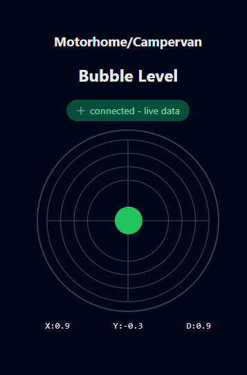

*****************************************************************************
* Motorhome/Campervan Bubble Level, by John Halfords, the Netherlands        
<a href="https://github.com/JohnHalfords/Motorhome-Campervan_Bubble_Level">Got to Github page...</a>
 
 

<table>
<tr>
  <td style="padding-left:10px;">
    <h2>What's new:</h2> 
    <b>1.1</b> <i>
    * 3 XY swap functions that can be true or false depending on how you've mounted the MPU </i>
    <b>1.2</b> <i>
    * mDNS so you can use a hostname to browse to instead of an ip-address </i>
    <b>2.0</b>  &nbsp;Included sensivity <i>
    * ChatGPT made an new Graphical design 
    * Put the wwwroot (in progmem) and the personal settings in seperate file </i>
    <b>2.1</b>  &nbsp;Exchange data with browser with 'WebSocket live stream' <i>
    * ChatGPT helped me with a stable websocket </i>
  </td>
  <td></td>
</tr>
</table>

-- Hardware --
--------------
* CPU: ESP8266 Wemos D1 Mini Pro (V3.0.0)
https://nl.aliexpress.com/item/1005006246625522.html

* Sensor: MPU6050/GY521
https://nl.aliexpress.com/item/1005007129504945.html

* Display: I2C OLED Display Module 0.91 Inch (SSD1306)
https://nl.aliexpress.com/item/1005006365845676.html

-- Connections --
-----------------
* See Schematic.png
* SDA = D2
* SCK or SCL = D1
* Internal Led = D4
* Reset switch = Pin RST to ground
* !! Make sure the MPU and the Display are connected to 3v3 and _NOT_ 5v

